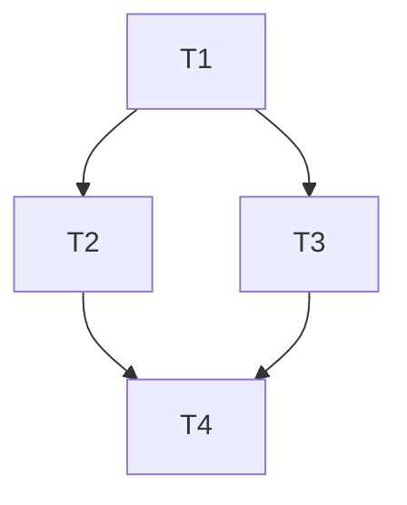

# cv-tasks-breakdown

Decompose a plan into small tasks that each land as one commit, keep the codebase working after every task, and track progress via sub-issues when a parent issue exists.

## When to Use

- Large feature or refactor (> ~500 lines expected)
- User provides a design doc, RFC, or implementation plan
- `cv-handle-issue` routes here when scope is too large for a single PR

## Core Rules

1. **Explicit dependencies** — every task has clear predecessors; no task starts until deps are done.
2. **Always shippable** — after each task, existing behavior and new behavior must both work; no broken intermediate states.
3. **One task ≈ one commit** — minimize diff size per task.
4. **Repeated touch is OK** — the same module may change in multiple tasks if decomposition requires it.
5. **Tests per task** — every task lists test case(s) that must pass before the task is considered done.

## Workflow

### Step 1: Understand the Plan

- Read the parent issue, design doc, or user description
- Identify modules, APIs, data paths, and acceptance criteria
- Estimate whether any single task would exceed ~300 lines changed

### Step 2: Draft Task List

For each task define:

| Field | Description |
| ----- | ----------- |
| Task ID | `T1`, `T2`, … sequential by dependency order |
| Title | Short verb phrase |
| Description | What this task delivers |
| Depends on | Task IDs (empty = no deps) |
| Test cases | Concrete tests to add or run |
| Existing behavior impact | What existing functionality is touched |
| Estimated scope | Files / modules (not line counts unless known) |

### Step 3: Global Preview Table

Present this table to the user **before** any implementation:

```markdown
## Task Breakdown Preview

| Order | Task | Depends | Description | Test Cases | Existing Behavior Impact |
| ----- | ---- | ------- | ----------- | ---------- | ------------------------ |
| 1 | T1: ... | — | ... | `cargo test -p ... test_name` | None |
| 2 | T2: ... | T1 | ... | ... | ... |
```

Add a **Commit Sequence Quick Reference** below the table:

```markdown
## Commit Sequence

1. `T1` → `feat(module): <short subject>`
2. `T2` → `feat(module): <short subject>`
```

Commit messages follow project commitlint; PR title uses `cv-create-pr` format when merged.

### Step 4: Dependency Graph

Show a simple mermaid or ASCII dependency graph when ≥ 3 tasks:



### Step 5: Clarify Blockers with User

**Stop and ask the user** when:

- Acceptance criteria are ambiguous
- Two tasks have circular or unclear dependencies
- A task cannot be made shippable without a flag / stub / feature gate
- Test strategy is unknown for a module
- Scope boundary (Goal vs Not Goal) is unclear

Do **not** start coding during breakdown. Iterate on the table until the user approves.

### Step 6: Sub-Issues (when parent issue exists)

If a parent GitHub issue is linked, create sub-issues via `cv-create-issue` or:

```bash
gh issue create \
  --title "[SUB] T1: <title>" \
  --label enhancement \
  --body "$(cat <<'EOF'
Parent: #<PARENT_NUMBER>

## Task
<description>

## Depends on
<task IDs or "none">

## Test Cases
- ...

## Acceptance
- [ ] Tests pass
- [ ] No regression in <modules>
EOF
)"
```

Reference parent in body: `Parent: #123`

### Step 7: Handoff

After user approval:

- Implement tasks **one at a time** in dependency order
- Each task → one commit → verify tests → next task
- Final PR via [cv-create-pr](../cv-create-pr/SKILL.md)

## Task Sizing Guidelines

| Signal | Action |
| ------ | ------ |
| > 500 lines or > 8 files | Split further |
| Touches public API + impl | Split: types/API first, impl second |
| Needs migration | Separate migration task with backward compat |
| Only tests + no prod change | OK as standalone task |

## Anti-Patterns

- Task that leaves `cargo test` or `make format` failing
- Task with no test coverage plan
- Task that depends on a later task
- One giant "implement everything" task

## Related

- Handle issue → [cv-handle-issue](../cv-handle-issue/SKILL.md)
- Create issue / sub-issue → [cv-create-issue](../cv-create-issue/SKILL.md)
- Submit work → [cv-create-pr](../cv-create-pr/SKILL.md)

See [references/task-table-template.md](references/task-table-template.md) for a copy-paste template.
