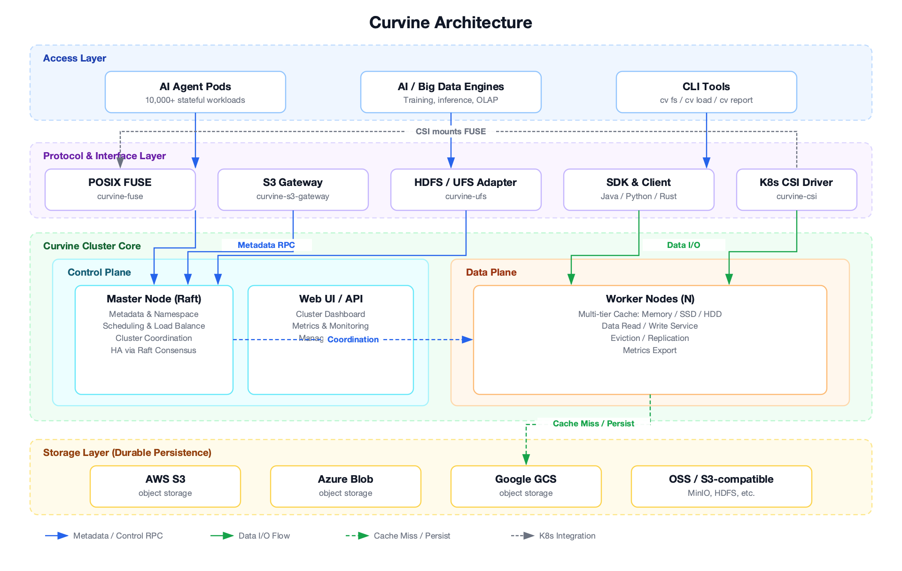

  English | 
  <a href="https://github.com/CurvineIO/curvine/blob/main/README_zh.md">简体中文</a> |
  <a href="https://readme-i18n.com/CurvineIO/curvine?lang=de">Deutsch</a> |
  <a href="https://readme-i18n.com/CurvineIO/curvine?lang=es">Español</a> |
  <a href="https://readme-i18n.com/CurvineIO/curvine?lang=fr">français</a> |
  <a href="https://readme-i18n.com/CurvineIO/curvine?lang=ja">日本語</a> |
  <a href="https://readme-i18n.com/CurvineIO/curvine?lang=ko">한국어</a> |
  <a href="https://readme-i18n.com/CurvineIO/curvine?lang=pt">Português</a> |
  <a href="https://readme-i18n.com/CurvineIO/curvine?lang=ru">Русский</a>

> **Curvine: AI-Native & Cloud-Native File System** — A high-performance POSIX file semantic layer built on top of cloud object storage, with an integrated multi-tier distributed cache, designed from the ground up for large-scale AI workloads and AI Agent platforms.

> **Name Origin** — "Curvine" is derived from *"Curvature Engine"*, the faster-than-light propulsion device in Liu Cixin's sci-fi novel *The Three-Body Problem*. It symbolizes the project's pursuit of extreme acceleration for data access.

---

## 📚 Documentation Resources

For more detailed information, please refer to:

- [Official Documentation](https://curvineio.github.io/docs/Overview/instroduction)
- [Quick Start](https://curvineio.github.io/docs/Deploy/quick-start)
- [Benchmark](https://curvineio.github.io/docs/category/benchmark)
- [DeepWiki](https://deepwiki.com/CurvineIO/curvine)
- [Best Practices](https://curvineio.github.io/docs/User-Manuals/best-practices)
- [Curvine passes LTP Test 1129 cases](https://curvineio.github.io/blog/2026/08/11/curvine-ltp-compatibility)
- [Tiered KV cache for large LLMs on Amazon SageMaker HyperPod with Curvine](https://aws.amazon.com/cn/blogs/machine-learning/tiered-kv-cache-for-large-llms-on-amazon-sagemaker-hyperpod-with-curvine/)
- [AI Agent Storage Selection: How Curvine Supports 10,000-Scale Agent Workloads on EKS](https://curvineio.github.io/blog/2026/07/07/ai-agent-storage-curvine-eks)

## 🚀 Core Features

- **AI-Native Positioning**: First-class support for AI training acceleration and AI Agent cloud-native storage as primary use cases, not an afterthought.
- **Multi-Cloud Object Storage Backend**: Compatible with object storage services from multiple cloud providers as the durable underlying layer, enabling transparent data migration across vendors.
- **Cloud-Native Kubernetes Integration**: Native CSI driver enables dynamic PVC provisioning, `Immediate` binding, volume expansion, and Helm-based cluster deployment.
- **Multi-Tier Cache**: Memory → SSD → HDD automatic tiering; hot data is transparently promoted to faster tiers.
- **Full POSIX Semantics via FUSE**: A high-performance FUSE layer presents distributed cached data as a local file system — `open`, `read`, `write`, `seek`, `rename`, `list` — enabling tools like Vite, `inotify`/`fswatch`, and `git` to work unmodified.
- **S3 & HDFS Protocol Compatibility**: Read/write through both S3 and HDFS interfaces for seamless integration with AI and big-data ecosystems.
- **Extreme Performance**: Rust core with Tokio async runtime, zero-copy data paths, and a GC-free memory model — ~100μs-class latency and 100K+ stable QPS.
- **Massive Metadata Capacity**: A single cluster supports **5 billion** small files, absorbing the aggregate metadata pressure of tens of thousands of Agents.
- **Metadata Independence**: Curvine's file metadata path maps **1:1** to the underlying S3 object path. Even if the Curvine service is unavailable, objects on S3 keep their original structure and remain independently accessible — fast and simple recovery.
- **Raft Consensus**: Master metadata is replicated via Raft for consistency and high availability.
- **Observability**: Built-in metrics system and Web UI for per-component performance monitoring.

## 📈 Use Cases

- **Case 1 — AI Agent Platform Storage**: Backing tens of thousands of stateful Agent Pods on Kubernetes with isolated POSIX workspaces, millisecond provisioning, and no per-node volume limits.
- **Case 2 — LLM Training Acceleration**: Caching training datasets and checkpoints close to GPU nodes to shorten training cycles.
- **Case 3 — LLM Model Distribution Acceleration**: Fast multi-region model artifact distribution through the distributed cache.
- **Case 4 — Multimodal Data Lake Access Acceleration**: POSIX access over multimodal lakes without copying data locally.
- **Case 5 — OLAP Query Acceleration**: Accelerating compute-storage separated OLAP engines with a hot data cache.
- **Case 6 — Multi-Cloud Data Caching**: A unified cache layer across multi-cloud object storage backends.

## 🏗️ Architecture Design

Curvine is a high-performance distributed cache file system built in Rust. It layers a distributed POSIX file system over cloud object storage, exposing full POSIX semantics upward while using object storage as the durable persistence layer downward. The architecture is organized into four cooperating layers, each color-coded in the diagram below:

- **Access Layer** — The workloads that use Curvine: AI Agent Pods (10,000+ stateful workloads), AI/big-data engines (training, inference, OLAP), and the native `cv` CLI.
- **Protocol & Interface Layer** — Multiple access paths so existing tools work unmodified: POSIX FUSE (`curvine-fuse`), an S3-compatible gateway, an HDFS/UFS adapter, Java/Python/Rust SDKs, and a native Kubernetes CSI driver for PVC provisioning.
- **Curvine Cluster Core** — The heart of the system, split into a **Control Plane** and a **Data Plane**:
  - *Control Plane*: the **Master node** (Raft-replicated) manages metadata, namespace, scheduling, load balancing, and cluster coordination, alongside a **Web UI / API** for dashboarding, metrics, and management.
  - *Data Plane*: a fleet of **Worker nodes** serving data from a multi-tier cache (Memory → SSD → HDD) with automatic hot-data promotion, eviction, and replication.
- **Storage Layer** — The durable underbelly: multi-cloud object storage (AWS S3, Azure Blob, Google GCS, OSS, and any S3-compatible store such as MinIO or HDFS). Workers transparently persist on cache miss and read back on demand.

**Data flow at a glance:** applications reach Curvine through any interface in the Protocol layer; metadata operations are routed to the Master via RPC, while data I/O is served directly by the Workers. On a cache miss, Workers fetch from — and persist back to — the underlying object storage. For Kubernetes workloads, the CSI driver mounts the FUSE file system directly as a PVC, so provisioning is just a `mkdir` on the shared namespace — millisecond-level, with no cloud control-plane API calls.

## 📊 Performance

Curvine is engineered for high-concurrency, low-latency workloads. Built on a Rust + Tokio async core with zero-copy data paths, it sustains ~100μs-class latency, 100K+ stable QPS, and 5 billion small files per cluster. The benchmarks below illustrate its edge in both metadata operations and raw data throughput.

### 1. Metadata Operation Performance

All benchmark comparisons were conducted with a concurrency level of 40.

| Operation Type | Curvine (QPS) | JuiceFS (QPS) | OSS (QPS) |
| --- | --- | --- | --- |
| create | 19,985 | 16,000 | 2,000 |
| open | 60,376 | 50,000 | 3,900 |
| rename | 43,009 | 21,000 | 200 |
| delete | 39,013 | 41,000 | 1,900 |

> Industry benchmark test data of comparable products: https://juicefs.com/zh-cn/blog/engineering/meta-perf-hdfs-oss-jfs

### 2. Data Read/Write Performance

Benchmarking against Alluxio under identical hardware conditions.

**256K sequential read**

| Thread count | Curvine Open Source Edition (GiB/s) | Open Source Alluxio (GiB/s) |
| --- | --- | --- |
| 1 | 2.2 | 0.6 |
| 2 | 3.7 | 1.1 |
| 4 | 6.8 | 2.3 |
| 8 | 8.9 | 4.5 |
| 16 | 9.2 | 7.9 |
| 32 | 9.5 | 8.8 |
| 64 | 9.2 | N/A |
| 128 | 9.2 | N/A |

**256K random read**

| Thread count | Curvine Open Source Edition (GiB/s) | Open Source Alluxio (GiB/s) |
| --- | --- | --- |
| 1 | 0.3 | 0.0 |
| 2 | 0.7 | 0.1 |
| 4 | 1.4 | 0.1 |
| 8 | 2.8 | 0.2 |
| 16 | 5.2 | 0.4 |
| 32 | 7.8 | 0.3 |
| 64 | 8.7 | N/A |
| 128 | 9.0 | N/A |

> Data disclosure from Alluxio official website: https://www.alluxio.com.cn/alluxio-enterprise-vs-open-source/.

### 3. Resource Consumption

Benefiting from Rust language features, in big data shuffle acceleration scenarios, comparing resource consumption between Curvine and Alluxio in production environments shows that memory usage is reduced by over 90%, and CPU usage is reduced by over 50%.

## Contributing
Please read Curvine [Contribute guidelines](CONTRIBUTING.md)

## 📜 License
Curvine is licensed under the ​**​[Apache License 2.0](LICENSE)​**.
