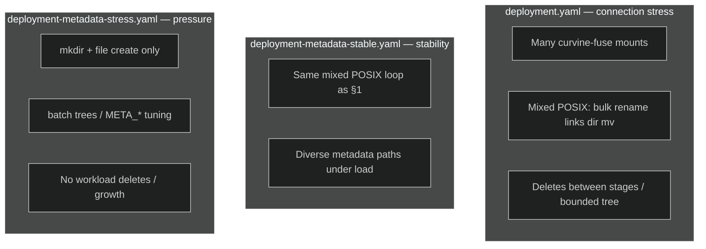

# Curvine benchmark workloads

Kubernetes manifests under `master-stress/` run **client-side workloads** against a Curvine cluster: each Pod starts one or more `curvine-fuse` processes and runs a bash script on the mount points. They are intended for **lab / staging** use; tune replicas, resources, and env vars before production-like clusters.

### Files and intent (read this first)

| Manifest | Purpose |
|----------|---------|
| `deployment-metadata-stable.yaml` | **Master / FUSE connection stress and metadata stability:** merged workload combining many mounts, **mixed POSIX operations** (bulk files, rename, hard/sym links, directory rename, mkdir/rmdir), and repeatable FUSE metadata exercises. Stages feature **deletes** to keep the tree churning (not growing forever), plus validation of **correctness and stability** of metadata paths (rename, links, readdir, etc.) under load. Use to test both connectivity/scale and diverse metadata semantics. |
| `deployment-metadata-stress.yaml` | **Metadata pressure / capacity:** only **`mkdir` + file create** under `.metadata-stress/`, **no** workload-level `rm`/`rmdir`. Goal is to **continuously add** directories and files (`batch-0`, `batch-1`, …) and stress **metadata volume**, master/RocksDB, and inode-related limits. |

**Apply rule:** `deployment.yaml` and `deployment-metadata-stable.yaml` both define the **same Kubernetes resource names** (e.g. StatefulSet `curvine-master-stress`, ConfigMap `curvine-stress-scripts`). Apply **only one** of them in a given namespace. `deployment-metadata-stress.yaml` uses a **different** app name and can coexist if namespaces or names differ.

**Namespace:** examples below use `curvine` where listed; your copy of a manifest may use `default` or another namespace—check `metadata.namespace` before `kubectl apply`.

**Prerequisites:**

- Curvine masters reachable from the cluster; set `Secret` key `master-addrs` (comma-separated `host:port`).
- Nodes can schedule **privileged** Pods with `hostPath` `/dev/fuse` and `SYS_ADMIN` (same pattern as CSI / FUSE tests).
- Image default: `ghcr.io/curvineio/curvine-csi:latest` (contains `curvine-fuse`, `curvine-cli`). Override in the StatefulSet if needed.

---

## 1. Master connection stress (`master-stress/deployment.yaml`)

### Scenario

- **Goal:** Stress **master connectivity and many FUSE mounts** with a **mixed POSIX workload** (create, list, stat, rename, hard/sym links, directory rename, mkdir/rmdir).
- **Behavior:** Each Pod runs `NUM_MOUNTS` independent `curvine-fuse` instances (`/fuse-mnts/curvine-fuse1` … `N`), each backed by a distinct remote fs-path.
- **Remote layout:** `STRESS_REMOTE_ROOT` / `${POD_NAME}` / `{i}` (default root: `/curvine-master-stress`).
- **Lifecycle:** By default, on start the entrypoint runs `curvine-cli fs rm --recursive` for **this Pod’s prefix only**, then `fs mkdir --parents` for each mount root. The workload loop **removes** files/dirs after each stage so the tree stays churning rather than growing without bound.

### When to use

- Validating stability under **many FUSE processes** talking to the same masters.
- Exercising **metadata + rename + link** code paths repeatedly.
- Measuring behavior with **`INTERVAL_SEC`** throttling between operations.

### Deploy / observe

```bash
kubectl apply -f master-stress/deployment.yaml
kubectl -n curvine get pods -l app=curvine-master-stress
kubectl -n curvine logs -f statefulset/curvine-master-stress
```

### Main environment variables

| Variable | Role |
|----------|------|
| `NUM_MOUNTS` | Number of FUSE instances per Pod (default `100` in script if unset; manifest often relies on default). |
| `STRESS_BULK_FILE_COUNT` | Serial bulk file create / ls / stat / rm count per loop iteration. |
| `INTERVAL_SEC` | Sleep between operations (fractional allowed). |
| `FUSE_WEB_PORT_BASE` | Base port for fuse web UI per mount (`+ i`). |
| `STRESS_REMOTE_ROOT` | Remote parent path for this stress run. |
| `SKIP_REMOTE_POD_CLEANUP` | `1` = skip `fs rm` on this Pod’s prefix at start. |
| `SKIP_REMOTE_MKDIR` | `1` = skip CLI mkdir (paths must already exist). |
| `FUSE_USE_DEFAULT_OPTS` | `1` = use curvine-fuse default FUSE options. |

Uncomment and set these under the StatefulSet `env:` section as needed.

### Demo-style load (qualitative)

The script runs **one infinite loop per mount**. Each loop issues a **serial** sequence of operations separated by `INTERVAL_SEC` (default `1` s if unset in the manifest). Rough structure per worker per iteration:

| Phase | Controlled by | What happens (high level) |
|-------|----------------|---------------------------|
| Bulk files | `STRESS_BULK_FILE_COUNT` = B | B writes → ls → du → B × stat → B × rm |
| Rename | — | write → ls → stat → du → mv → ls → stat → rm |
| Links | — | write → hardlink → symlink → ls → stat → readlink → du → rm × 3 |
| Dir rename | — | mkdir → write → du → stat → mv dir → ls → du → rm file → rmdir |
| mkdir/rmdir | — | mkdir → rmdir |

**Order-of-magnitude:** one loop is on the order of **3B + ~30** separate steps, each followed by `INTERVAL_SEC` sleep (so wall time grows linearly with B and `INTERVAL_SEC`). With **`NUM_MOUNTS` = N**, you have **N workers** doing that in parallel on **N** remote subtrees (`…/${POD_NAME}/1..N`), so aggregate master/FUSE load scales about **× N**.

**Example:** `NUM_MOUNTS=100`, `STRESS_BULK_FILE_COUNT=10`, `INTERVAL_SEC=1` → each worker ~60 sleeps per loop → **~60 s** per loop per mount if every step succeeds; 100 mounts hammer the cluster concurrently.

### Resource names

- StatefulSet / Service: `curvine-master-stress`
- ConfigMap: `curvine-stress-scripts`
- Secret: `curvine-stress-master` (`master-addrs`)

---

## 2. Metadata stability (`master-stress/deployment-metadata-stable.yaml`)

### Scenario

- **Goal:** **Metadata stability** testing—repeatedly drive **many different FUSE-facing operations** (bulk create/stat/rm, file rename, hard and symbolic links, directory rename, mkdir/rmdir) so Curvine’s metadata handling is exercised under a realistic **mix** of syscalls, not a single opcode.
- **Relationship to §1:** This file is the **same pattern as the original `deployment.yaml`** workload (same script shape and resource names). Keep it when you want a manifest **explicitly dedicated** to stability runs, or when your repo pins different images/env per profile. Behavior, env vars, and deploy commands match §1 unless you edited the YAML.
- **Not for capacity burn-down:** The loop **deletes** after each stage; inode count on the remote tree does **not** monotonically grow like the stress manifest.

### Deploy / observe

Same labels and object names as §1 (`curvine-master-stress`). Use the same `kubectl` commands as §1 but point at this file:

```bash
kubectl apply -f master-stress/deployment-metadata-stable.yaml
kubectl -n curvine get pods -l app=curvine-master-stress
kubectl -n curvine logs -f statefulset/curvine-master-stress
```

(Adjust `-n` to match `metadata.namespace` in your file.)

See §1 for environment variables, demo load table, and resource names.

---

## 3. Metadata pressure / growth (`master-stress/deployment-metadata-stress.yaml`)

### Scenario

- **Goal:** **Pressure** test—push **file and directory inode / metadata growth** toward cluster limits by **continuously creating** objects (no workload `rm` / `rmdir`).
- **Behavior:** Same FUSE bootstrap pattern, but workers only **`mkdir` + small files** under `.metadata-stress/`, in repeating **`batch-0`, `batch-1`, …** trees.
- **Remote layout:** `STRESS_REMOTE_ROOT` / `${POD_NAME}` / `{i}` (default root: `/curvine-metadata-stress` — different from master-stress to avoid sharing the same remote tree).

### When to use

- Capacity planning: **metadata volume**, master/RocksDB pressure, or inode-related limits.
- Long runs with `SKIP_REMOTE_POD_CLEANUP=1` to **accumulate** objects across restarts (use with care).

### Deploy / observe

```bash
kubectl apply -f master-stress/deployment-metadata-stress.yaml
kubectl -n curvine get pods -l app=curvine-metadata-stress
kubectl -n curvine logs -f statefulset/curvine-metadata-stress
```

### Tree parameters (`META_*`)

Let **D** = `META_DIR_DEPTH`, **F** = `META_FANOUT`, **K** = `META_FILES_PER_DIR`.

- **`META_DIR_DEPTH` (D):** From each `batch-*` root, how many **levels** of “fanout expansion” to apply before reaching leaf directories. `D=0` means no subdirectories under `batch-*`, only `K` files there.
- **`META_FANOUT` (F):** For each directory while `depth > 0`, create **F** child directories, then recurse with `depth - 1`. Child names are `dir-<globalCounter>` for uniqueness.
- **`META_FILES_PER_DIR` (K):** After children are processed, create **K** files in **every** directory that participates in the recursion (including `batch-*` and internal nodes). Use **`META_WRITE_FILE_DATA`**: `0` (default) = empty file via `touch`; `1` = one-byte payload via `echo "m" > file` (exercises data path slightly).

**File count per batch (exact for this script):**  
`N_files = K × N_dirs`.  
`N_dirs` counts the `batch-*` directory plus every `dir-*` mkdir under it for that batch.

#### Formulas for `N_dirs` (one `batch-*` tree)

Let **D** = `META_DIR_DEPTH`, **F** = `META_FANOUT`, **K** = `META_FILES_PER_DIR`.

| Case | Condition | `N_dirs` | `N_files` |
|------|-----------|----------|-----------|
| Flat batch | `D = 0` | `1` | `K` |
| Fanout tree | `D ≥ 1` and `F ≥ 2` | `1 + F + F² + … + F^D = (F^{D+1} − 1) / (F − 1)` | `K × N_dirs` |
| Single chain | `D ≥ 1` and `F = 1` | `1 + D` (root + one child per level) | `K × (1 + D)` |
| No fanout | `D ≥ 1` and `F = 0` | `1` (no subdirs created; files only under `batch-*`) | `K` |

Then **each completed batch** adds **`N_dirs` directories** and **`N_files` files** on that mount (plus the next `batch-(n+1)` repeats).

**`META_BATCH_COUNT` (default `0`):** `0` = unlimited batches. If **B ≥ 1**, each mount’s worker builds **`batch-0` … `batch-(B−1)`** (exactly **B** trees), then exits. Per mount, cumulative dirs ≈ **`B × N_dirs`** and files ≈ **`B × N_files`** (each `batch-*` is one top-level dir per tree). With **`NUM_MOUNTS` = M**, multiply those totals by **M** (each mount has its own counter). After all workers finish, the entrypoint runs **`sleep infinity`** so the Pod stays **Running** for logs and inspection; delete the Pod or send SIGTERM to stop. With **unlimited** batches, aggregate growth per “one batch round” across mounts is still about **× M** vs a single mount (workers are not synchronized).

#### Worked examples (per mount, one batch)

| D | F | K | `N_dirs` (calculation) | `N_files` |
|---|---|---|-------------------------|-----------|
| 2 | 4 | 20 | `1+4+16 = 21` | `21×20 = 420` |
| 0 | * | 50 | `1` | `50` |
| 1 | 10 | 100 | `1+10 = 11` | `1100` |
| 3 | 2 | 5 | `1+2+4+8 = 15` | `75` |
| 4 | 2 | 1 | `1+2+4+8+16 = 31` | `31` |
| 5 | 1 | 20 | `1+5 = 6` | `120` |
| 2 | 0 | 30 | `1` | `30` |
| 3 | 3 | 10 | `1+3+9+27 = 40` | `400` |

**Large-tree warning:** e.g. `D=4`, `F=10` → `N_dirs = 11111`, and with `K=20` → **222220 files per batch** on that mount alone. Increase **D/F/K** gradually.

**Other knobs:**

| Variable | Role |
|----------|------|
| `META_OP_PAUSE_SEC` | Sleep after each mkdir or file create (throttle master; fractional OK). |
| `META_BATCH_PAUSE_SEC` | Sleep after finishing one full `batch-*` tree. |
| `META_BATCH_COUNT` | `0` = unlimited; `B ≥ 1` = run **B** batches (`batch-0` … `batch-B−1`) per mount, then worker exits; entrypoint then idles (`sleep infinity`). |
| `META_WRITE_FILE_DATA` | `0` = `touch` (empty file); `1` = `echo "m"` (minimal write). |
| `META_STOP_ON_ERROR` | `1` = exit worker on first failure (easier to capture limit errors). |
| `NUM_MOUNTS` | Parallel FUSE workers (default `1` in metadata script). |

**Caution:** `F` and `D` together grow **roughly like F^D** directories per batch. Increase gradually to avoid OOM or overwhelming the master.

### Resource names

- StatefulSet / Service: `curvine-metadata-stress`
- ConfigMap: `curvine-metadata-stress-scripts`
- Secret: `curvine-stress-master` (same name as master-stress; `kubectl apply` merges if already present)

---

## Comparison (at a glance)



| Aspect | `deployment.yaml` | `deployment-metadata-stable.yaml` | `deployment-metadata-stress.yaml` |
|--------|---------------------|-----------------------------------|-----------------------------------|
| Primary intent | Many mounts + master/FUSE churn | **Metadata stability** (mixed ops, same family as §1) | **Metadata pressure** (monotonic growth) |
| FUSE operations | Mixed POSIX + deletes each round | Same idea as §1 | mkdir + create files only |
| Namespace growth | Churn (rm between stages) | Churn (rm between stages) | Grows until limits / manual cleanup |
| Default remote root | `/curvine-master-stress` | Same as §1 unless changed | `/curvine-metadata-stress` |
| Key tuning | `NUM_MOUNTS`, `INTERVAL_SEC`, `STRESS_BULK_FILE_COUNT` | Same as §1 | `META_DIR_DEPTH`, `META_FANOUT`, `META_FILES_PER_DIR`, `META_WRITE_FILE_DATA`, `META_BATCH_COUNT`, pauses |
| K8s name clash with §1 | — | **Yes** (do not apply both) | **No** (different StatefulSet name) |

---

## Example use cases

1. **Smoke (connection or stability):** Apply `deployment.yaml` or `deployment-metadata-stable.yaml` with defaults; confirm Pod Running and logs show mount OK + worker loops.
2. **High mount count (§1 or §2):** Set `NUM_MOUNTS` to 50–200 (watch CPU/memory and master QPS).
3. **Metadata stability soak:** Run `deployment-metadata-stable.yaml` (or `deployment.yaml`) for hours/days with tuned `INTERVAL_SEC` to watch for leaks, stuck mounts, or RPC errors across rename/link/readdir paths.
4. **Slower, gentler master load:** Increase `INTERVAL_SEC` (§1/§2) or `META_OP_PAUSE_SEC` (§3).
5. **Metadata pressure, small tree:** `deployment-metadata-stress.yaml` with `META_DIR_DEPTH=0`, `META_FILES_PER_DIR=1000`, many batches over time.
6. **Deep narrow tree (§3):** `META_DIR_DEPTH=5`, `META_FANOUT=1`, moderate `META_FILES_PER_DIR`.
7. **Wide shallow tree (§3):** `META_DIR_DEPTH=2`, `META_FANOUT=10`, small `META_FILES_PER_DIR` first.
8. **Accumulate across Pod restarts:** `SKIP_REMOTE_POD_CLEANUP=1` on metadata **stress** (§3); disk/metadata usage grows; plan cleanup separately.
9. **Fail fast at limit (§3):** `META_STOP_ON_ERROR=1` when probing inode or space ceilings.
10. **Isolate from another run:** Change `STRESS_REMOTE_ROOT` so two StatefulSets do not share the same remote prefix.
11. **Multi-replica:** Increase StatefulSet `replicas` only after checking anti-affinity and node capacity (each replica is another full stress Pod).

---

## Cleanup

```bash
kubectl delete -f master-stress/deployment.yaml
# Only if you applied it (not alongside deployment.yaml):
kubectl delete -f master-stress/deployment-metadata-stable.yaml
kubectl delete -f master-stress/deployment-metadata-stress.yaml
```

Remote paths are **not** deleted by these commands; use `curvine-cli fs rm --recursive <path>` (or your ops procedure) if you need to reclaim cluster metadata/storage.
